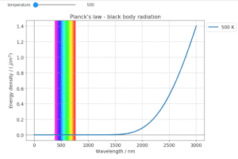
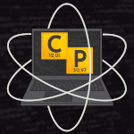
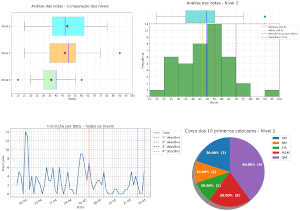
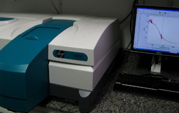
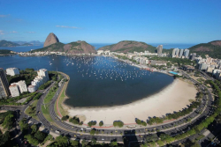

## Desenvolvimento de materiais interativos para ensino de química

{: .align-left}
Pesquisador responsável por grupo de estudos no IFRJ para desenvolver materiais interativos, baseados na linguagem de programação Python e na ferramenta Jupyter Notebook, que auxiliem no aprendizado das disciplinas de química.

Busca-se mostrar a aplicação das ferramentas em exercícios e em problemas aplicados e desenvolver nos estudantes, tanto os envolvidos na elaboração do projeto quanto nos que terão acesso aos materiais interativos desenvolvidos, maior afinidade e desenvoltura com o uso de técnicas computacionais e mostrar como podem ser utilizadas para tratar dados e comunicar resultados.

{: .align-center}

Exemplos de materiais já desenvolvidos:

- [Demonstração interativa da Lei de Planck](https://github.com/chicolucio/planck)
- [Visualização das diferenças entre modelos de carga nuclear efetiva](https://github.com/chicolucio/zeff)
- [Visualização da superfície pressão x volume x temperatura em gases ideais](https://github.com/chicolucio/ideal_gases)
- [Visualização e comparação de dados de solublidade de compostos inorgânicos](https://github.com/chicolucio/solutions)

Também desenvolvi um projeto não relacionado ao ensino de química e, sim, ao ensino de lógica matemática: um [gerador de tabelas-verdade](https://github.com/chicolucio/truth-table-generator).

## Projeto Ciência Programada

{: .align-left}
Projeto pessoal de uma plataforma de divulgação científica, com foco em uso e desenvolvimento de ferramentas tecnológicas.
Mostro como podemos utilizar Python e softwares para entender melhor conceitos científicos e situações do cotidiano.

Links do projeto: [site](https://cienciaprogramada.com.br/), [Instagram](https://instagram.com/cienciaprogramada),
[Twitter](https://twitter.com/cienciaprog) e [YouTube](https://www.youtube.com/channel/UCrUs_osDl_GaHgUdU7v3YGw).

## Python no tratamento estatístico de dados

{: .align-left}
Demonstração de como usar Python e sua biblioteca Pandas para avaliar o desempenho de estudantes em uma Olimpíada de Química. O material é aberto para a comunidade com o intuito de mostrar as potencialidades de uso para os professores e alunos da instituição envolvida e outras que também façam atividades similares e que gostariam de avaliar seus resultados. [Link do projeto](https://github.com/chicolucio/estatisticas-oiq-2019).

## (2014 - 2015) Gestão de laboratórios multiusuários de uma Central Analítica

{: .align-left}
Durante meu período como químico responsável pela Central Analítica do Instituto de Química da UFF - Universidade Federal Fluminense tive o grande desafio de tornar mais acessível e eficiente o fluxo de análises dos diversos laboratórios que compunham a Central. Para isso:

- organizei a elaboração de Procedimentos Operacionais Padrões (POPs) para diversos equipamentos;
- desenvolvi, com o auxílio de ferramentas gratuitas como o Google Calendar e Google Forms devido a restrições orçamentárias, um sistema simples mas eficiente de agendamento e controle de uso dos equipamentos de cada laboratório parte da Central;
- por ter conhecimentos de desenvolvimento web, passei a compor a equipe de elaboração dos sites dos laboratórios, atualizando as páginas já existentes para apresentarem os POPs e o sistema de agendamento.

Os laboratórios ainda utilizam o sistema desenvolvido atualmente como, por exemplo, o [Laboratório Multiusuário de Caracterização de Materiais](http://www.lamate.uff.br/index.php/formularios-new) e o [Laboratório Multiusuário de Espectroscopia](http://www.lame.uff.br/index.php/formularios).

## (2014) Aprimoramento de sistema de acompanhamento de efluentes líquidos

{: .align-left}
Enquanto ocupei o cargo de Analista Ambiental no Instituto Estadual do Ambiente do Rio de Janeiro (INEA) participei da equipe da Gerência de Avaliação de Qualidade de Água. Colaborei com o aprimoramento do sistema de acompanhamento de relatórios do [Programa de Autocontrole de Efluentes Líquidos](http://www.inea.rj.gov.br/procon-agua/), desenvolvendo planilhas eletrônicas para auxiliar nas demandas de análise da grande quantidade de dados e, também, auxiliando nos estudos de novos índices de qualidade de água.

## (2008 - 2013) Síntese e caracterização de compostos com atividade antitumoral

{: .align-center}

Durante boa parte de minha graduação e todo o mestrado fui aluno do Laboratório de Síntese Organometálica sob orientação do professor Mauricio Lanznaster. Fui pioneiro no laboratório da linha de pesquisa *Síntese e caracterização de compostos de coordenação como protótipos de pró-drogas biorredutíveis*, linha esta que desenvolvi durante todo o tempo citado. Traduzindo para uma linguagem mais acessível, buscávamos desenvolver compostos que, em ambiente tumoral, atuassem liberando fármacos para auxiliar no tratamento dos mesmos.

{: .align-center}

Pela própria característica do tema, foi um projeto multidisciplinar onde várias habilidades foram desenvolvidas. Desenvolvi um método espectrofotométrico para acompanhar a liberação do fármaco, me tornando líder no laboratório no que diz respeito a design e interpretação de experimentos espectrofotométricos nas regiões do infravermelho e ultravioleta-visível. Mais ao final do projeto, começamos a elaborar estudos computacionais para modelar o comportamento dos compostos em estudo, o que também foi uma novidade no laboratório.

Ter sido o aluno que começou o projeto foi desafiador mas muitos resultados vieram. Dezenas de trabalhos foram enviados a congressos nacionais e internacionais (uma lista completa está no meu [currículo Lattes](http://lattes.cnpq.br/4657840420064295)), além de terem sido publicados [um artigo](http://dx.doi.org/10.5935/1984-6835.20090016) em revista nacional e três artigos em revistas internacionais de grande alcance ([artigo 1](http://dx.doi.org/10.1016/j.poly.2012.04.027), [artigo 2](http://dx.doi.org/10.1021/ic302175t), [artigo 3](http://dx.doi.org/10.1016/j.jinorgbio.2013.11.007)).
